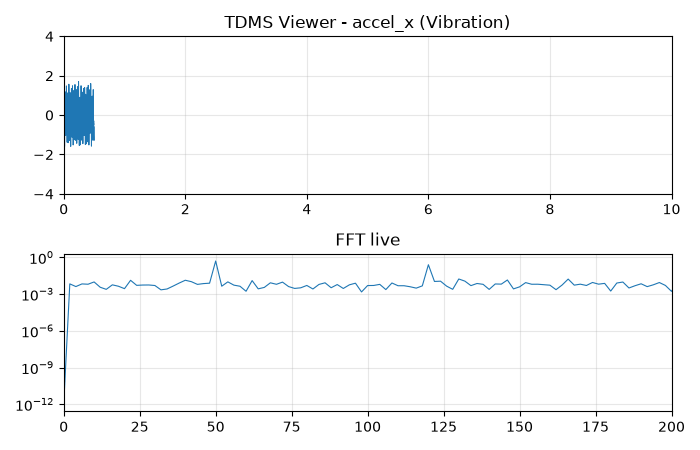

# TDMS Viewer & Report

Outil gratuit/open-source pour ouvrir, visualiser et exporter des fichiers `.tdms` (NI/LabVIEW) **sans licence DIAdem ni LabVIEW**.



## Fonctionnalités

- Drag-drop `.tdms` (upload jusqu'à 500 Mo, ou mode **fichier local** pour les gros fichiers)
- Groupes, canaux, métadonnées et propriétés (capteurs, unités, fréquence)
- Courbes interactives Plotly (zoom, pan, multi-canaux, décimation auto ~2000 pts)
- FFT + filtres passe-bas/haut + détection de pics
- Export CSV et rapport PDF (métadonnées + courbe + spectre)

## Lancer

```powershell
pip install -r requirements.txt
python generate_test_tdms.py --output data/demo.tdms   # fichier de test (pas besoin de LabVIEW)
streamlit run app.py                                    # http://localhost:8501
```

Fichiers réels de test (fournis avec `nptdms`) : `data/real_samples/`.

## Pourquoi c'est rapide sur gros fichiers

Lecture streaming (`TdmsFile.open`), métadonnées sans charger les données,
décimation côté serveur, re-fetch pleine résolution au zoom.

Mesuré sur `data/big_500mo.tdms` (15 M pts/canal, 480 Mo) via `python bench_big.py` :

| étape | temps |
|---|---|
| structure (sans charger) | 0.03 s |
| courbe affichée 2000 pts (×7500) | 0.16 s |
| re-fetch zoom 100k pts | 0.01 s |
| FFT 100k pts (raie 50 Hz OK) | instantané |

Excel/DIAdem Viewer calent au-delà de ~500 Mo ; ici le fichier entier n'est jamais chargé.

## Structure

```
app.py                 dashboard Streamlit
tdms_utils.py          lecture streaming + décimation + export CSV
analysis.py            FFT, filtres, pics
report.py              rapport PDF
generate_test_tdms.py  générateur de .tdms synthétiques (par blocs, fichiers multi-Go)
bench_big.py           bench streaming gros fichiers
data/real_samples/     vrais .tdms de test (package nptdms)
```

## Roadmap

- [x] MVP : lecture, courbes, CSV
- [x] V2 : FFT, pics, PDF, bench 500 Mo
- [ ] Pro : rapports de conformité, multi-Go, 29-49 €/mois

## Licence

MIT — voir `LICENSE`.
