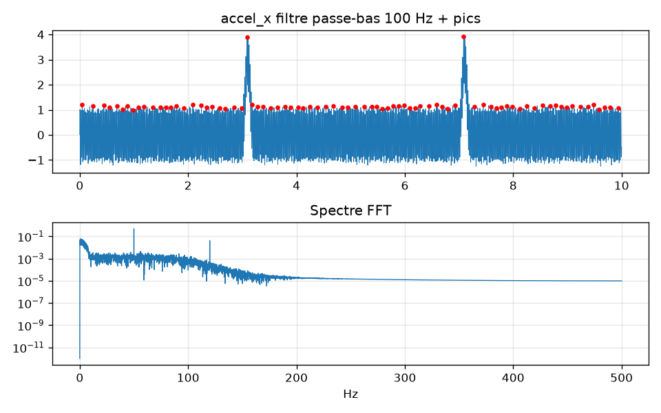

# TDMS Viewer & Report

[](https://github.com/axelscemana/tdms-viewer/actions)

Outil gratuit/open-source pour ouvrir, visualiser et exporter des fichiers `.tdms` (NI/LabVIEW) **sans licence DIAdem ni LabVIEW**.


## Fonctionnalités

- Drag-drop `.tdms` (upload jusqu'à 500 Mo, ou mode **fichier local** pour les gros fichiers)
- Groupes, canaux, métadonnées et propriétés (capteurs, unités, fréquence)
- Courbes interactives Plotly (zoom, pan, multi-canaux, décimation auto ~2000 pts)
- FFT + filtres passe-bas/haut + détection de pics
- Export CSV et rapport PDF (métadonnées + courbe + spectre)

## Lancer

```powershell
pip install -r requirements.txt
python generate_test_tdms.py --output data/demo.tdms   # fichier de test (pas besoin de LabVIEW)
streamlit run app.py                                    # http://localhost:8501
```

Fichiers réels de test (fournis avec `nptdms`) : `data/real_samples/`.

## Export batch (service : .tdms -> CSV)

```powershell
python -m cli export --input data/demo.tdms --out exports
python -m cli export --input data/lot_client --out exports --recursive
python -m cli export --input data/gros.tdms --out exports --group Vibration --chunk 100000
# gros fichiers (>1M lignes, limite Excel 1048576) : morceaux _partN.csv + CSV complet
python -m cli export --input data/lot_client --out exports --recursive --split 500000
```

- Streaming par blocs (RAM constante, OK 2 Go), `manifest.json` par fichier.
- CSV avec séparateur `;` : s'ouvre directement en 2 colonnes dans Excel français
  (plus de Convertir / Texte en colonnes).
- Noms LabVIEW avec `/ :` assainis pour Windows. Vieux `.tdms_index` ignoré auto.
- Valeurs **scalées** (nptdms `scaled=True`) : le CSV contient des Volts, et le manifest
  trace `scaling_applied, scale_types, unit`. Preuve sur lot réel VeriStand :
  voir `docs/lot_reel_preuve.md` + `docs/lot_reel_8133.png`.
- Le dashboard accepte aussi les `.csv` exportés (même analyse FFT/filtres/pics + PDF).

## Docker (pour les PC sans Python)

```powershell
docker build -t tdms-viewer .
docker run -p 8501:8501 tdms-viewer        # http://localhost:8501
docker run -p 8501:8501 -v ${PWD}/data:/app/data tdms-viewer   # + mode fichier local
```

## Exemples

- Analyse (filtre + pics + FFT) : 
- Rapport PDF : [docs/rapport_exemple.pdf](docs/rapport_exemple.pdf)

## Pourquoi c'est rapide sur gros fichiers

Lecture streaming (`TdmsFile.open`), métadonnées sans charger les données,
décimation côté serveur, re-fetch pleine résolution au zoom.

Mesuré via `python bench_big.py` (ou `tdms-viewer bench --file ...`) :

| fichier | structure | courbe 2000 pts | zoom 100k | FFT |
|---|---|---|---|---|
| 480 Mo (15 M pts/canal) | 0.03 s | 0.16 s (×7500) | 0.01 s | instantanée, 50 Hz OK |
| **2 Go (64 M pts/canal)** | **0.06 s** | **0.74 s (×32000)** | **0.02 s** | **instantanée, 50 Hz OK** |

Excel/DIAdem Viewer calent au-delà de ~500 Mo ; ici le fichier entier n'est jamais chargé.

## Structure

```
app.py                 dashboard Streamlit
tdms_utils.py          lecture streaming + décimation + export CSV
analysis.py            FFT, filtres, pics
report.py              rapport PDF
generate_test_tdms.py  générateur de .tdms synthétiques (par blocs, fichiers multi-Go)
bench_big.py           bench streaming gros fichiers
data/real_samples/     vrais .tdms de test (package nptdms)
```

## Roadmap

- [x] MVP : lecture, courbes, CSV
- [x] V2 : FFT, pics, PDF, bench 500 Mo
- [ ] Pro : rapports de conformité, multi-Go, 29-49 €/mois

## Licence

MIT — voir `LICENSE`.
