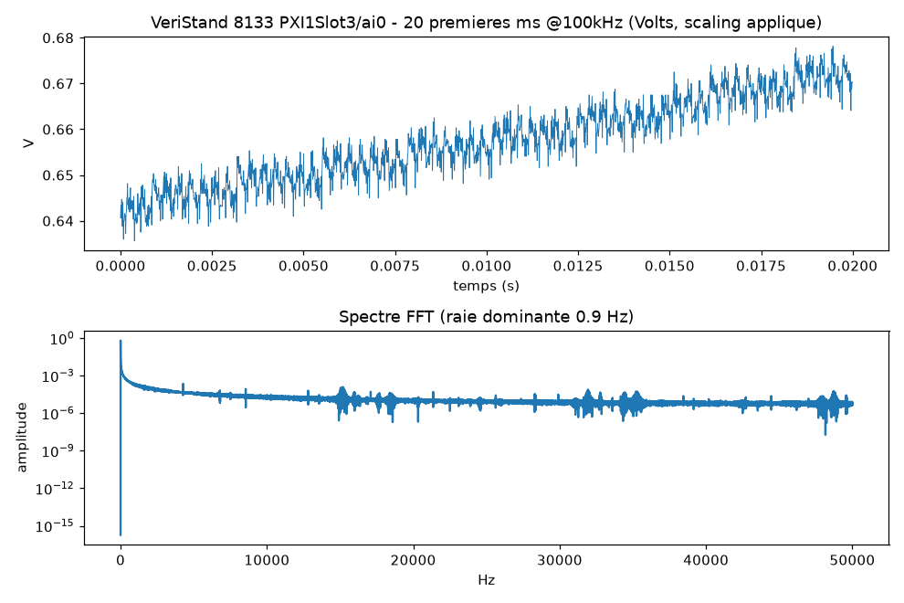

# Preuve lot reel : VeriStand 8133/8108 (sans DIAdem ni LabVIEW)

Source : fichiers d'exemple publics NI VeriStand (repo NIVeriStandAdd-Ons/Time-Align-NIVS-TDMS-Files-Tool), usage demo locale.
Fichiers testes : veristand_8133.tdms (2,21 Mo, 1 103 872 pts) + veristand_8108.tdms (2,24 Mo, 1 118 208 pts).
Commande : python -m cli export --input data/lot_reel --out exports/lot_reel -> 2 CSV, 2 222 080 lignes.
Graphe controle : 

## Scaling

- nptdms lit en scaled=True : le CSV contient des Volts (Polynomial applique), pas des comptes ADC bruts.
- Manifest par canal : scaling_applied, scaling_status, scale_types, unit (ici Polynomial, Volts).

## Extrait CSV 8133 (10 premieres lignes)

| x (s) | y (V) |
|---|---|
| 0.00000000 | 0.640647 |
| 0.00001000 | 0.643459 |
| 0.00002000 | 0.640647 |
| 0.00003000 | 0.644709 |
| 0.00004000 | 0.640960 |
| 0.00005000 | 0.638773 |
| 0.00006000 | 0.644084 |
| 0.00007000 | 0.639710 |
| 0.00008000 | 0.635961 |
| 0.00009000 | 0.640022 |

## Manifest 8133

```json
{
  "source": "data\\lot_reel\\veristand_8133.tdms",
  "file_properties": {
    "name": "100k 8133-0004"
  },
  "exported": [
    {
      "file": "exports\\lot_reel\\veristand_8133\\100k 8133_PXI1Slot3_ai0.csv",
      "rows": 1103872,
      "group": "100k 8133",
      "channel": "PXI1Slot3/ai0",
      "scaling_applied": true,
      "scaling_status": "unscaled",
      "scale_types": [
        "Polynomial"
      ],
      "unit": "Volts"
    }
  ]
}
```

## Stats 8133
- lignes : 1103872
- y min/max : 0.222 / 3.541 V
- pas x median : 1.00e-05 s (=100 kHz)
- raie dominante FFT : 0.9 Hz